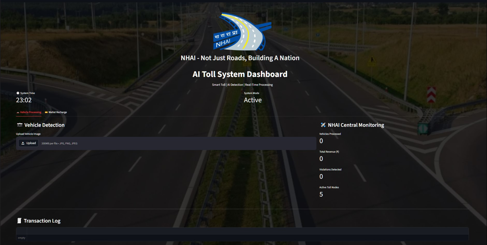
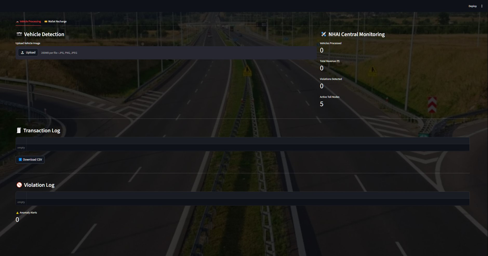
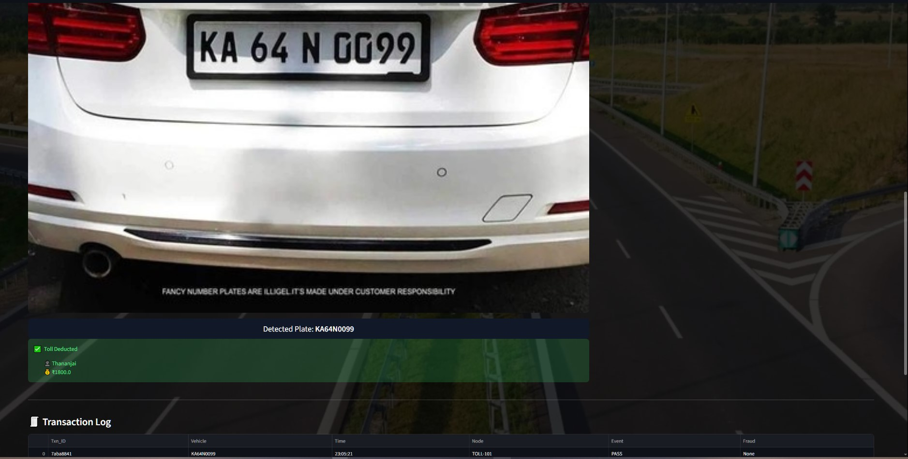
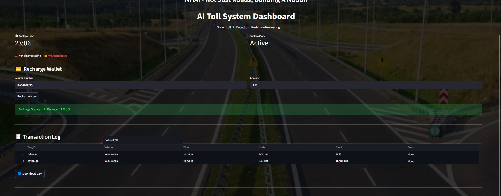

# 🚗 NHAI AI Toll System Dashboard

An AI-powered prototype for barrier-free toll collection that uses Automatic Number Plate Recognition (ANPR) and Optical Character Recognition (OCR) to identify vehicles, automate toll deduction, and monitor transactions through an interactive web dashboard.
 
> Developed using Python, OpenCV, Tesseract OCR, Streamlit, Twilio, and JSON.

---

## 📌 Overview

This project demonstrates how AI can be applied to modernize toll collection by eliminating physical barriers and reducing manual intervention.

The system detects vehicle number plates from uploaded images, validates vehicle information from a database, performs automated toll deduction, records transactions, identifies anomalies, and sends SMS notifications.

---

## ✨ Features

- 🚗 Automatic Number Plate Recognition (ANPR)
- 🔍 OCR using Tesseract
- 🧠 OpenCV image preprocessing
- 💰 Automatic toll deduction
- 📱 SMS notifications using Twilio
- 💳 Wallet recharge module
- 📊 Streamlit monitoring dashboard
- 📜 Transaction logging
- 🚫 Violation logging
- ⚠️ Basic anomaly detection across toll nodes
- 📥 CSV transaction report export

---

## 🛠️ Technologies Used

- Python
- Streamlit
- OpenCV
- Tesseract OCR
- Pandas
- Twilio API
- JSON Database

---

## 📂 Project Structure

```
.
├── app.py             # Streamlit dashboard
├── core.py            # OCR and toll processing engine
├── recharge.py        # Wallet recharge interface
├── ai_toll.py         # Standalone OCR testing script
├── vehicles.json      # Vehicle database
├── bg.jpg             # Dashboard background
├── nhai.png           # NHAI logo
└── README.md
```

---

## Dashboard Preview





## Vehicle Detection



## Wallet Recharge



## 🎥 Demo

[▶ Watch the Demo Video](ai_toll_demo.mp4)

---

## ⚙️ Installation

### 1. Clone the repository

```bash
git clone https://github.com/<your-username>/<repository-name>.git

cd <repository-name>
```

---

### 2. Install Python packages

```bash
pip install streamlit opencv-python pytesseract pandas twilio pillow
```

---

### 3. Install Tesseract OCR

Download and install Tesseract OCR.

Windows:

https://github.com/UB-Mannheim/tesseract/wiki

Update the path in `core.py` if required.

Example:

```python
pytesseract.pytesseract.tesseract_cmd = r"C:\Program Files\Tesseract-OCR\tesseract.exe"
```

---

## ▶️ Run the Application

Launch the Streamlit dashboard:

```bash
streamlit run app.py
```

The dashboard will open automatically in your browser.

---

## 🔄 System Workflow

1. Upload a vehicle image.
2. OpenCV preprocesses the image.
3. Tesseract OCR extracts the vehicle number.
4. Vehicle details are verified from the JSON database.
5. System checks:
   - Registration status
   - Wallet balance
   - Pending violations
6. Toll amount is deducted.
7. SMS notification is sent.
8. Transaction is recorded.
9. Dashboard updates in real time.

---

## 📈 Dashboard Features

- Vehicle Detection
- Wallet Recharge
- Live Monitoring
- Transaction Log
- Violation Log
- Fraud / Anomaly Alerts
- CSV Report Download

---

## 🚀 Future Enhancements

- Real-time video stream processing
- High-resolution ANPR cameras
- Cloud database integration
- GPS-assisted anomaly detection
- Multi-lane toll monitoring
- Advanced deep learning-based plate recognition

---

## 📄 License

This project was developed for academic demonstration and research purposes.
